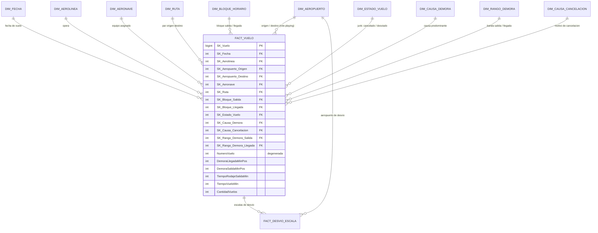

# Proyecto Final de Business Intelligence - Avance
## Data Mart de Puntualidad Operacional Aérea — *Airline On-Time Performance* (BTS / US DOT)

| Ítem | Detalle |
|---|---|
| **Fuente de datos** | Bureau of Transportation Statistics (BTS), Office of Airline Information — U.S. Department of Transportation |
| **Dataset** | *Reporting Carrier On-Time Performance (1987 – presente)* |
| **URL de descarga** | https://www.transtats.bts.gov/DL_SelectFields.aspx?gnoyr_VQ=FGJ&QO_fu146_anzr=b0-gvzr |
| **Naturaleza** | Dato primario, real, de reporte obligatorio (14 CFR Part 234). **No sintético.** |
| **Granularidad de origen** | Un registro por segmento de vuelo doméstico programado |
| **Volumetría** | Del orden de 10^5–10^6 registros por archivo mensual y del orden de 10^8 registros en la serie histórica completa (magnitud a verificar contra la descarga efectiva) |
| **Periodicidad de publicación** | Mensual, con rezago aproximado de 45–75 días |
| **Formato de entrega** | CSV delimitado por comas, comprimido en ZIP, más tablas de *lookup* independientes |

---

# 1. Marco Teórico

## 1.1 Business Intelligence como disciplina de ingeniería de la información

| Dimensión de diseño | Sistema OLTP (operacional) | Sistema OLAP (analítico) |
|---|---|---|
| **Unidad de trabajo** | Transacción atómica sobre pocas filas | Consulta de agregación sobre millones de filas |
| **Modelo lógico** | Relacional normalizado (3FN / BCNF) | Multidimensional (estrella / copo de nieve / cubo) |
| **Patrón de acceso** | Alta selectividad, índices B-Tree, *point lookups* | Baja selectividad, *full scan*, índices *bitmap* o almacenamiento columnar |
| **Temporalidad** | Estado actual; el dato se sobrescribe | Serie histórica; el dato se acumula y se versiona |
| **Optimización** | Minimizar redundancia y anomalías de actualización | Minimizar *joins* y latencia de lectura; la redundancia es aceptable |

### 1.2.1 Los cuatro pasos canónicos de diseño

1. **Seleccionar el proceso de negocio.** En este proyecto: la *ejecución de un vuelo comercial programado*, desde el bloqueo de calendario (CRS) hasta el arribo a puerta.
2. **Declarar el grano.** Principio inviolable: *declare the grain before anything else*. El grano debe ser el **más atómico posible**, porque la agregación prematura destruye de forma irreversible la capacidad de responder preguntas futuras no anticipadas.
3. **Identificar las dimensiones.** Son los «¿quién, qué, cuándo, dónde, por qué, cómo?» del hecho.
4. **Identificar los hechos.** Deben ser numéricos, aditivos (idealmente) y consistentes con el grano declarado.

### 1.2.2 Taxonomía de aditividad de las métricas

La clasificación de aditividad determina qué agregaciones son semánticamente válidas y constituye la principal fuente de errores analíticos en la práctica profesional:

- **Aditivas**: sumables sobre *todas* las dimensiones. Ej.: `Flights` (conteo de vuelos), `DepDelayMinutes` (minutos de demora en salida), `Distance`.
- **Semiaditivas**: sumables sobre algunas dimensiones pero no sobre el tiempo. Ej.: aeronaves en tierra en un instante, *gates* ocupados.
- **No aditivas**: razones, porcentajes y promedios. Ej.: *On-Time Performance* (%), factor de cumplimiento. **Regla de ingeniería: nunca se almacena la razón; se almacenan numerador y denominador como métricas aditivas y la razón se calcula en la capa semántica** (`SUM(num)/SUM(den)`), jamás como `AVG` de razones precalculadas, que incurre en la falacia del promedio de promedios (paradoja de Simpson).

### 1.2.3 Tipologías de tablas de hechos

- **Transaccional** (*transaction fact*): una fila por evento. Es la tabla principal de este proyecto.
- **Instantánea periódica** (*periodic snapshot*): una fila por entidad por periodo. Útil para agregados diarios por aeropuerto.
- **Instantánea acumulada** (*accumulating snapshot*): una fila por instancia de un proceso con múltiples hitos, actualizada conforme el proceso avanza. **El ciclo de vida de un vuelo es un caso de libro de texto**: `CRSDepTime → DepTime → WheelsOff → WheelsOn → ArrTime`, con *lags* calculados entre hitos (`TaxiOut`, `AirTime`, `TaxiIn`).
- **Sin hechos** (*factless fact table*): registra la ocurrencia de un evento o una cobertura sin métricas asociadas. Permite analizar *lo que no ocurrió* — por ejemplo, contrastar vuelos programados contra vuelos efectivamente operados para medir cancelaciones.

### 1.2.4 Técnicas dimensionales específicas aplicables al dominio

- **Claves subrogadas** (*surrogate keys*): enteros secuenciales sin significado de negocio que desacoplan el almacén de las claves naturales del sistema operacional. Son **obligatorias** en este caso porque el propio BTS advierte que *los códigos de aeropuerto pueden reutilizarse* y que *un mismo código IATA puede haber sido asignado a distintas aerolíneas a lo largo del tiempo*.
- **Dimensiones lentamente cambiantes (SCD)**: Tipo 1 (sobrescritura, se pierde la historia), **Tipo 2 (versionado por filas con `fecha_inicio`, `fecha_fin` y `flag_vigente`)**, Tipo 3 (columna de valor previo). El campo `OriginAirportSeqID` del BTS es, de hecho, **una implementación nativa de SCD Tipo 2 en el origen**: identifica un aeropuerto *en un punto del tiempo*, mientras que `OriginAirportID` identifica la entidad persistente.
- **Dimensiones *role-playing***: una misma dimensión física que asume múltiples roles semánticos mediante vistas o alias. En este modelo, `DIM_AEROPUERTO` juega los roles de *Origen*, *Destino* y *Aeropuerto de Desvío*; `DIM_FECHA` juega los roles de *fecha de vuelo* y *fecha de arribo*.
- **Dimensiones *junk***: consolidación de banderas y atributos de baja cardinalidad, mutuamente correlacionados, en una única dimensión con el producto cartesiano de sus valores posibles. `Cancelled`, `CancellationCode`, `Diverted` y `DivReachedDest` son candidatos naturales.
- **Dimensiones degeneradas**: atributos de identificación que residen en la tabla de hechos porque carecen de atributos descriptivos propios. `Flight_Number_Reporting_Airline` es el caso típico.
- **Dimensiones conformadas** (*conformed dimensions*): dimensiones compartidas e idénticamente definidas entre múltiples procesos de negocio. Son el mecanismo que garantiza la integración empresarial y se documentan mediante la **matriz de bus** (*bus matrix*).

## 1.3 Arquitectura de referencia y el ciclo ETL/ELT

La arquitectura propuesta sigue un patrón multicapa (*medallion architecture*):

```
  ┌──────────────┐   ┌───────────────┐   ┌────────────────┐   ┌──────────────┐
  │   FUENTE     │ → │   STAGING     │ → │  DATA MART     │ → │  CONSUMO     │
  │              │   │   (Bronze)    │   │  DIMENSIONAL   │   │              │
  │ BTS CSV/ZIP  │   │ Carga cruda   │   │  (Gold)        │   │ Power BI /   │
  │ Lookup tables│   │ tipada 1:1    │   │ Estrella +     │   │ Tableau /    │
  │              │   │ + Silver:     │   │ agregados      │   │ SQL ad-hoc   │
  │              │   │ limpieza,     │   │                │   │              │
  │              │   │ conformación  │   │                │   │              │
  └──────────────┘   └───────────────┘   └────────────────┘   └──────────────┘
        Extract            Transform              Load             Analyze
```

**Consideraciones de ingeniería específicas para este dataset:**

1. **Estrategia de carga incremental.** Dado el volumen, una recarga completa (*full refresh*) es inviable. Se adopta carga incremental particionada por `Year`/`Month`, aprovechando que el BTS publica archivos mensuales inmutables. La partición física de la tabla de hechos por `SK_Fecha` habilita *partition pruning* en el motor.
2. **Tratamiento de nulos con semántica.** El nulo en este dataset **no es ruido, es información**: `ArrDelay IS NULL` en un vuelo con `Cancelled = 1` significa «el vuelo no llegó», no «dato faltante». El ETL debe preservar esta distinción y **no imputar cero**, pues ello sesgaría a la baja todos los indicadores de demora.
3. **Cobertura temporal heterogénea de atributos.** Las causas de demora (`CarrierDelay`, `WeatherDelay`, `NASDelay`, `SecurityDelay`, `LateAircraftDelay`) existen **solo desde junio de 2003**, y la información de retorno a puerta y de desvíos **solo desde octubre de 2008**. Todo análisis longitudinal debe acotar la ventana temporal o declarar explícitamente la discontinuidad.
4. **Sesgo de reporte.** Solo reportan las aerolíneas que superan el umbral de participación en el mercado doméstico establecido por el DOT (históricamente, 1 % de los ingresos domésticos de pasajeros). El universo **no es censal respecto de todos los operadores**, y la composición del panel de reportantes cambia entre años. Es un sesgo de cobertura que debe documentarse en los metadatos.
5. **Calidad de datos.** Se implementan reglas de validación en la capa Silver: consistencia aritmética (`ArrDelay = ArrTime − CRSArrTime`, módulo cambio de día), coherencia lógica (`Cancelled = 1 ⇒ ArrTime IS NULL`), integridad referencial contra las tablas de *lookup*, rangos válidos de horas (`0000–2400`) y detección de valores atípicos por rango intercuartílico.

## 1.4 Especificidad del dominio: BI aplicado a la analítica aeronáutica

La industria aérea presenta tres características que la convierten en un caso de estudio privilegiado para BI:

**(a) Es un sistema de red con propagación de perturbaciones.** El transporte aéreo es un grafo dirigido donde las aeronaves se encadenan en rotaciones. Una demora inicial se propaga aguas abajo por la red: es precisamente lo que el BTS captura con la categoría `LateAircraftDelay`. La analítica debe soportar, por tanto, no solo agregación estática sino **análisis de propagación y efectos de segundo orden**, lo que exige conservar `Tail_Number` para reconstruir la secuencia de vuelos de cada aeronave.

**(b) Es un sistema con restricciones de capacidad rígidas.** Pistas, *gates*, *slots* y espacio aéreo (gestionado por el *National Airspace System*) tienen capacidad instantánea acotada. La demanda es marcadamente no uniforme (picos horarios, estacionalidad semanal y anual), lo que genera congestión. Esto justifica dimensiones de **bloque horario** (`DepTimeBlk`, `ArrTimeBlk`) y de **calendario enriquecido** (feriados, temporada alta).

**(c) Es un sistema intensamente regulado y comparado públicamente.** El *Air Travel Consumer Report* del DOT publica rankings mensuales de puntualidad. El BI aquí no es solo interno: alimenta *benchmarking* competitivo y cumplimiento regulatorio.

### 1.4.1 Indicadores canónicos de la industria (KPI)

| KPI | Definición operacional | Fórmula sobre el modelo |
|---|---|---|
| **OTP / A14** (*On-Time Performance*) | % de vuelos que arriban con menos de 15 min de demora | `1 − SUM(ArrDel15) / SUM(Vuelos_Operados)` |
| **D0 / DEP0** | % de vuelos que salen a la hora programada o antes | `SUM(CASE WHEN DepDelay <= 0 THEN 1 ELSE 0 END) / SUM(Flights)` |
| **Completion Factor** | % de vuelos programados efectivamente operados | `1 − SUM(Cancelled) / SUM(Vuelos_Programados)` |
| **Average Delay per Flight** | Minutos promedio de demora por vuelo | `SUM(ArrDelayMinutes) / SUM(Vuelos_Operados)` |
| **Average Delay per Delayed Flight** | Severidad condicional de la demora | `SUM(ArrDelayMinutes) / SUM(ArrDel15)` |
| **Block Time Variance** | Desviación del tiempo real respecto del programado | `SUM(ActualElapsedTime − CRSElapsedTime) / SUM(Flights)` |
| **Taxi-Out Time** | Minutos de rodaje en origen (*proxy* de congestión de pista) | `SUM(TaxiOut) / SUM(Vuelos_Operados)` |
| **Schedule Padding** | Holgura incorporada al itinerario | `AVG(CRSElapsedTime − AirTime − TaxiIn − TaxiOut)` |
| **Delay Root-Cause Share** | Descomposición porcentual de la demora por causa | `SUM(CausaX) / SUM(Carrier+Weather+NAS+Security+LateAircraft)` |
| **Diversion Rate** | Tasa de desvíos | `SUM(Diverted) / SUM(Vuelos_Programados)` |

> **Nota metodológica crítica:** la descomposición por causa **solo está poblada para vuelos con demora en arribo ≥ 15 minutos**. El denominador correcto para el análisis de causa raíz es, por tanto, el subconjunto de vuelos demorados, no el universo de vuelos. Confundir ambos denominadores es el error analítico más frecuente con este dataset.

## 1.5 Gestión de datos masivos: implicancias arquitectónicas

Con una serie histórica del orden de 10^8 filas y más de 100 atributos por registro, el diseño físico determina la viabilidad del proyecto:

- **Almacenamiento columnar** (Parquet, ORC, motores MPP). Las consultas analíticas proyectan típicamente entre 5 y 10 columnas de más de 100; el formato columnar reduce la E/S en uno a dos órdenes de magnitud y habilita compresión por tipo (RLE, *dictionary encoding*) altamente efectiva sobre atributos de baja cardinalidad como códigos de aerolínea y de aeropuerto.
- **Particionamiento y *clustering*.** Partición por `Year`/`Month`; *clustering* secundario por `SK_Aeropuerto_Origen` y `SK_Aerolinea`.
- **Tablas agregadas (*aggregate navigation*).** Se materializan agregados a grano día–aerolínea–aeropuerto y mes–aerolínea–ruta. Una consulta de tendencia mensual que sobre el grano atómico escanea 10^8 filas, sobre el agregado escanea 10^5. El motor semántico redirige la consulta de forma transparente para el usuario.
- **Compresión de dimensiones mediante claves subrogadas enteras.** Sustituir cadenas de texto (`OriginCityName`, de hasta 50 caracteres) por enteros de 4 bytes en la tabla de hechos reduce el ancho de fila de forma determinante a esta escala.
- **Trade-off explícito: redundancia por velocidad.** La desnormalización de las jerarquías geográficas (aeropuerto → ciudad → estado → región) dentro de una única dimensión plana multiplica el almacenamiento de la dimensión, pero esta representa menos del 0,01 % del volumen total del *data mart*; el ahorro en *joins* sobre la tabla de hechos justifica ampliamente el costo.

---

# 2. Descripción de la Empresa y Problemática de Negocio

## 2.1 El organismo: Bureau of Transportation Statistics

El **Bureau of Transportation Statistics (BTS)** es la agencia estadística federal del *U.S. Department of Transportation* (US DOT), creada por el *Intermodal Surface Transportation Efficiency Act* de 1991. Su **Office of Airline Information (OAI)** administra el sistema de reporte obligatorio establecido en el **14 CFR Part 234 (*Airline Service Quality Performance*)**.

**Modelo operativo del reporte:**

- Las aerolíneas que superan el umbral de participación en el mercado doméstico de pasajeros deben reportar, con periodicidad mensual, el desempeño de **cada segmento de vuelo doméstico programado** que operan.
- El reporte incluye horas programadas (CRS, *Computerized Reservation System*), horas reales de puerta y de pista, cancelaciones con código de causa, desvíos y la atribución de minutos de demora a cinco categorías causales estandarizadas.
- El BTS valida, consolida y publica los microdatos de forma abierta, sin costo y sin restricción de uso, constituyendo uno de los repositorios de desempeño operacional más extensos y longevos del mundo (serie continua desde octubre de 1987).

## 2.2 Contexto del sector: la economía de la puntualidad

El transporte aéreo comercial estadounidense moviliza del orden de 10^9 pasajeros-segmento al año y opera con estructuras de costo caracterizadas por:

- **Alta proporción de costos fijos y hundidos** (flota, mantenimiento programado, tripulación bajo convenio colectivo, *slots* aeroportuarios).
- **Márgenes operativos históricamente estrechos**, típicamente de un dígito.
- **Activos de altísima rotación**: una aeronave de fuselaje estrecho puede ejecutar de 4 a 6 rotaciones diarias; cada minuto de inmovilización no planificada tiene un costo de oportunidad directo.

En este contexto, **la demora no es una molestia de servicio: es un consumidor de margen de primer orden**. Cada minuto de demora genera costos directos (combustible en rodaje y en espera, horas extra de tripulación sujetas a límites de *duty time* regulados por la FAA, tasas aeroportuarias, reacomodación y compensación de pasajeros, pernoctaciones) y costos indirectos (pérdida de conexiones y de ingresos por *misconnects*, deterioro reputacional, desplazamiento de demanda hacia competidores, penalizaciones en acuerdos corporativos). La literatura del sector sitúa el costo directo por minuto de demora en el orden de decenas a cerca de un centenar de dólares según el tipo de aeronave y la etapa del vuelo — **magnitud que el propio proyecto debe estimar y parametrizar, no asumir**.

Adicionalmente, el fenómeno posee una **externalidad de red**: una demora originada en un *hub* congestionado se propaga a través de las rotaciones de aeronaves y tripulaciones hacia vuelos posteriores geográficamente distantes. La categoría `LateAircraftDelay` del BTS mide exactamente esta propagación y, en la práctica, suele constituir una de las dos causas de mayor peso agregado, lo que revela que **una fracción significativa de la demora observada es endógena al sistema, no exógena al clima**.

## 2.3 Definición de la problemática de negocio

> **Problema central:**
> Las aerolíneas, las autoridades aeroportuarias y el propio regulador disponen de un volumen masivo de microdatos operacionales (del orden de 10^8 registros históricos y más de 100 atributos por vuelo), pero **carecen de una estructura analítica que permita transformar ese volumen en decisiones oportunas**. Los datos se distribuyen como archivos planos mensuales, altamente desnormalizados, con codificación que exige resolución contra tablas de *lookup* externas, con cobertura temporal heterogénea entre atributos y con una semántica de nulos no trivial. En consecuencia, el análisis se realiza de forma artesanal, aislada, no reproducible y con una latencia incompatible con la toma de decisiones operativa.

**Manifestaciones concretas del problema:**

| # | Síntoma observado | Consecuencia de negocio |
|---|---|---|
| P1 | Imposibilidad de atribuir la demora a su causa raíz de forma sistemática y comparable | Se invierte en mitigaciones mal dirigidas (p. ej., holgura de itinerario) cuando la causa dominante es la propagación de rotaciones |
| P2 | Desconocimiento de la distribución espacio-temporal de la congestión | Programación de itinerarios en bloques horarios y aeropuertos estructuralmente saturados |
| P3 | Ausencia de *benchmarking* aerolínea–ruta–aeropuerto homogéneo | Imposibilidad de fijar metas de puntualidad realistas y diferenciadas por contexto operativo |
| P4 | Falta de medición del sesgo sistemático entre tiempo programado (CRS) y tiempo real | Itinerarios con holgura excesiva (pérdida de productividad de flota) o insuficiente (incumplimiento crónico) |
| P5 | Nula trazabilidad de la propagación de demoras a nivel de aeronave | No se identifican las rotaciones críticas donde una intervención temprana evitaría el efecto cascada |
| P6 | Análisis de cancelaciones y desvíos desacoplado del análisis de demoras | Visión parcial de la confiabilidad; el *Completion Factor* y el OTP se gestionan en silos |

## 2.4 Objetivos del proyecto

**Objetivo general.** Diseñar e implementar un *data mart* dimensional sobre el dataset *Airline On-Time Performance* del BTS que habilite el análisis multidimensional, reproducible y de baja latencia del desempeño de puntualidad de la aviación comercial doméstica estadounidense, con el fin de identificar, cuantificar y priorizar los factores determinantes de las demoras y cancelaciones de vuelos.

**Objetivos específicos.**

1. **OE1.** Construir un proceso ETL incremental que ingeste los archivos mensuales del BTS, resuelva las tablas de *lookup*, aplique reglas de calidad y cargue el modelo dimensional preservando la semántica de nulos.
2. **OE2.** Diseñar un esquema en estrella con al menos ocho dimensiones conformadas y una tabla de hechos transaccional a grano de segmento de vuelo programado.
3. **OE3.** Implementar la batería de KPI canónicos de la industria (OTP, D0, *Completion Factor*, *Block Time Variance*, *Taxi-Out*, descomposición causal) como medidas calculadas sobre métricas aditivas.
4. **OE4.** Cuantificar la contribución relativa de cada causa de demora por aerolínea, aeropuerto, ruta, bloque horario y estacionalidad.
5. **OE5.** Caracterizar la propagación de demoras mediante el encadenamiento de vuelos por `Tail_Number`, aislando el componente endógeno del sistema.
6. **OE6.** Identificar los pares aeropuerto–bloque horario y las rutas con desempeño estructuralmente deficiente, como insumo para el rediseño de itinerarios.
7. **OE7.** Entregar tableros analíticos orientados a tres audiencias: dirección de operaciones (táctico), planeamiento de red (estratégico) y cumplimiento regulatorio (*reporting*).

## 2.5 Preguntas de negocio que el modelo debe responder

1. ¿Cuál es el OTP por aerolínea y cómo ha evolucionado por trimestre? ¿La brecha entre la mejor y la peor aerolínea se amplía o se reduce?
2. ¿Qué proporción de los minutos totales de demora es atribuible a cada causa (*Carrier*, *Weather*, *NAS*, *Security*, *Late Aircraft*) y cómo varía esa composición por aeropuerto y estación del año?
3. ¿Existe un efecto de bloque horario? ¿Cuánto se degrada el OTP entre el primer banco de salidas de la mañana y el último de la noche, y en qué aeropuertos la degradación es más pronunciada?
4. ¿Qué rutas concentran la mayor cantidad de minutos de demora en términos absolutos, y cuáles en términos de demora por vuelo operado? (La distinción separa el problema de volumen del problema de desempeño.)
5. ¿Cuál es el sesgo entre `CRSElapsedTime` y `ActualElapsedTime` por ruta y aerolínea? ¿Hay evidencia de *schedule padding* sistemático y cuánta capacidad de flota consume?
6. ¿Cómo se comparan las tasas de cancelación por código de causa (`A` = Carrier, `B` = Weather, `C` = NAS, `D` = Security) entre aeropuertos y entre meses?
7. ¿Qué aeronaves (`Tail_Number`) presentan mayor demora acumulada y en qué punto de su rotación diaria se origina la degradación?
8. ¿Cuál es el impacto del `TaxiOut` en el desempeño global y qué aeropuertos operan sistemáticamente por encima de su percentil histórico?
9. ¿Existe correlación entre la distancia de la ruta (`DistanceGroup`) y la capacidad de recuperación en vuelo (`DepDelay − ArrDelay`)?
10. ¿Cuál es el costo operacional estimado de la demora por aerolínea, bajo un modelo de costo por minuto parametrizable?

## 2.6 Alcance y delimitación

| Aspecto | Dentro del alcance | Fuera del alcance |
|---|---|---|
| **Geográfico** | Vuelos domésticos dentro de EE. UU. y territorios | Vuelos internacionales |
| **Temporal** | Ventana propuesta: enero 2015 – último mes publicado (ajustable) | Serie previa a 2003 para análisis causal (los campos de causa no existen) |
| **Operadores** | Aerolíneas sujetas a reporte obligatorio bajo 14 CFR Part 234 | Aviación general, carga pura, operadores por debajo del umbral |
| **Funcional** | Analítica descriptiva y diagnóstica (¿qué pasó? ¿por qué pasó?) | Modelos predictivos de demora (posible extensión futura) |
| **Datos** | Campos de desempeño, causa, cancelación, desvío y geografía | Datos de pasajeros, tarifas y carga (*T-100*, *DB1B* — datasets BTS distintos) |

---

# 3. Diccionario de Datos

Se documentan los campos del archivo fuente, clasificados por su rol en el modelo dimensional. La columna **Rol** indica el destino del campo: `DIM` (atributo dimensional), `FK` (clave foránea derivada), `MET` (métrica de hecho), `DD` (dimensión degenerada), `AUX` (auxiliar de ETL o de derivación).

## 3.1 Periodo temporal

| Campo | Tipo | Descripción | Rol | Dominio / Observaciones |
|---|---|---|---|---|
| `Year` | INT | Año del vuelo | DIM | 1987 – actual |
| `Quarter` | TINYINT | Trimestre | DIM | 1–4 |
| `Month` | TINYINT | Mes | DIM | 1–12; *lookup* disponible |
| `DayofMonth` | TINYINT | Día del mes | DIM | 1–31 |
| `DayOfWeek` | TINYINT | Día de la semana | DIM | 1 = lunes … 7 = domingo |
| `FlightDate` | DATE | Fecha del vuelo (`yyyymmdd`) | **FK** | Clave natural de `DIM_FECHA`. Corresponde a la **fecha de salida programada en hora local del origen**, no a la fecha de arribo |

## 3.2 Aerolínea

| Campo | Tipo | Descripción | Rol | Dominio / Observaciones |
|---|---|---|---|---|
| `Reporting_Airline` | CHAR(7) | Código único de transportista. Ante reutilización del código se añade sufijo numérico (`PA`, `PA(1)`, `PA(2)`) | DIM | **Campo recomendado por el BTS para análisis multianual** |
| `DOT_ID_Reporting_Airline` | INT | Identificador asignado por el US DOT. Único por certificado DOT, independiente de cambios de código, nombre o *holding* | **DIM (clave natural)** | Clave natural estable de `DIM_AEROLINEA` |
| `IATA_CODE_Reporting_Airline` | CHAR(3) | Código IATA de uso comercial | DIM | **No es único en el tiempo**; usar solo para presentación, nunca para *join* |
| `Tail_Number` | VARCHAR(10) | Matrícula de la aeronave | **FK** | Clave natural de `DIM_AERONAVE`. Nulo frecuente en vuelos cancelados. Permite reconstruir rotaciones |
| `Flight_Number_Reporting_Airline` | INT | Número de vuelo comercial | **DD** | Dimensión degenerada; se reutiliza cíclicamente entre temporadas |

## 3.3 Origen

| Campo | Tipo | Descripción | Rol | Dominio / Observaciones |
|---|---|---|---|---|
| `OriginAirportID` | INT | ID de aeropuerto asignado por el US DOT, **estable en el tiempo** | **FK (clave natural)** | Campo recomendado para análisis multianual; los códigos IATA pueden reutilizarse |
| `OriginAirportSeqID` | INT | ID de aeropuerto **en un punto específico del tiempo** | AUX / SCD2 | Cambia cuando cambian atributos del aeropuerto (nombre, coordenadas). Base natural del versionado SCD Tipo 2 |
| `OriginCityMarketID` | INT | ID de mercado-ciudad | DIM | Consolida aeropuertos que sirven un mismo mercado (p. ej., JFK + LGA + EWR → Nueva York) |
| `Origin` | CHAR(3) | Código IATA del aeropuerto de origen | DIM | Atributo de presentación |
| `OriginCityName` | VARCHAR(50) | Ciudad del aeropuerto de origen | DIM | Formato `Ciudad, ST` |
| `OriginState` | CHAR(2) | Código de estado | DIM | Nivel jerárquico 3 |
| `OriginStateFips` | CHAR(2) | Código FIPS del estado | DIM | Clave de integración con datasets censales de EE. UU. |
| `OriginStateName` | VARCHAR(50) | Nombre del estado | DIM | — |
| `OriginWac` | INT | *World Area Code* | DIM | Nivel jerárquico superior (agrupación geográfica DOT) |

## 3.4 Destino

Estructura **simétrica e idéntica** a la de origen: `DestAirportID`, `DestAirportSeqID`, `DestCityMarketID`, `Dest`, `DestCityName`, `DestState`, `DestStateFips`, `DestStateName`, `DestWac`.

> **Implicancia de diseño:** esta simetría es la justificación formal para implementar `DIM_AEROPUERTO` como **dimensión *role-playing*** única, referenciada dos veces (origen y destino) desde la tabla de hechos, en lugar de duplicar físicamente la tabla. Duplicarla rompería la conformidad dimensional e introduciría riesgo de divergencia en el mantenimiento.

## 3.5 Desempeño de salida

| Campo | Tipo | Descripción | Rol | Observaciones |
|---|---|---|---|---|
| `CRSDepTime` | CHAR(4) | Hora de salida programada (local, `hhmm`) | AUX / FK | CRS = *Computerized Reservation System*. Base de `DIM_BLOQUE_HORARIO` |
| `DepTime` | CHAR(4) | Hora real de salida de puerta (local, `hhmm`) | AUX | Nulo si el vuelo fue cancelado |
| `DepDelay` | INT | Minutos de diferencia entre salida programada y real. **Valores negativos = salida anticipada** | **MET** | Aditiva. Permite medir adelantos |
| `DepDelayMinutes` | INT | Igual que `DepDelay`, con adelantos truncados a 0 | **MET** | Aditiva. **Métrica estándar de la industria para demora** |
| `DepDel15` | BIT | Indicador de demora ≥ 15 min (1 = sí) | **MET** | Aditiva. Numerador del D15 |
| `DepartureDelayGroups` | SMALLINT | Intervalo de demora en tramos de 15 min (de `<-15` a `>180`) | **FK** | Clave natural de `DIM_RANGO_DEMORA` |
| `DepTimeBlk` | CHAR(9) | Bloque horario programado de salida (intervalos de 1 h) | **FK** | Clave natural de `DIM_BLOQUE_HORARIO` (rol salida) |
| `TaxiOut` | INT | Minutos de rodaje desde puerta hasta despegue | **MET** | Aditiva. *Proxy* de congestión de pista en origen |
| `WheelsOff` | CHAR(4) | Hora de despegue (local, `hhmm`) | AUX | Hito del *accumulating snapshot* |

## 3.6 Desempeño de llegada

| Campo | Tipo | Descripción | Rol | Observaciones |
|---|---|---|---|---|
| `WheelsOn` | CHAR(4) | Hora de aterrizaje (local, `hhmm`) | AUX | Hito del *accumulating snapshot* |
| `TaxiIn` | INT | Minutos de rodaje desde aterrizaje hasta puerta | **MET** | Aditiva. *Proxy* de disponibilidad de *gate* en destino |
| `CRSArrTime` | CHAR(4) | Hora de llegada programada (local, `hhmm`) | AUX / FK | — |
| `ArrTime` | CHAR(4) | Hora real de llegada a puerta (local, `hhmm`) | AUX | Nulo en cancelados y desviados |
| `ArrDelay` | INT | Minutos de diferencia entre llegada programada y real. Negativos = arribo anticipado | **MET** | Aditiva. **Métrica raíz del OTP** |
| `ArrDelayMinutes` | INT | Igual que `ArrDelay`, con anticipos truncados a 0 | **MET** | Aditiva |
| `ArrDel15` | BIT | Indicador de demora en llegada ≥ 15 min | **MET** | Aditiva. **Numerador canónico del A14/OTP** |
| `ArrivalDelayGroups` | SMALLINT | Intervalo de demora en tramos de 15 min | **FK** | `DIM_RANGO_DEMORA` (rol llegada) |
| `ArrTimeBlk` | CHAR(9) | Bloque horario programado de llegada | **FK** | `DIM_BLOQUE_HORARIO` (rol llegada) |

## 3.7 Cancelaciones y desvíos

| Campo | Tipo | Descripción | Rol | Dominio |
|---|---|---|---|---|
| `Cancelled` | BIT | Indicador de vuelo cancelado (1 = sí) | **MET + FK** | Métrica aditiva y atributo de `DIM_ESTADO_VUELO` |
| `CancellationCode` | CHAR(1) | Causa de la cancelación | **FK** | `A` = Carrier, `B` = Weather, `C` = National Air System, `D` = Security; nulo si no fue cancelado |
| `Diverted` | BIT | Indicador de vuelo desviado (1 = sí) | **MET + FK** | Métrica aditiva y atributo de `DIM_ESTADO_VUELO` |

## 3.8 Resumen del vuelo

| Campo | Tipo | Descripción | Rol | Observaciones |
|---|---|---|---|---|
| `CRSElapsedTime` | INT | Duración programada puerta a puerta, en minutos | **MET** | Aditiva. Base del cálculo de holgura |
| `ActualElapsedTime` | INT | Duración real puerta a puerta, en minutos | **MET** | Aditiva. **Nulo en todos los vuelos desviados** |
| `AirTime` | INT | Tiempo en vuelo (*wheels-off* a *wheels-on*), en minutos | **MET** | Aditiva. `ActualElapsedTime = TaxiOut + AirTime + TaxiIn` |
| `Flights` | INT | Conteo de vuelos | **MET** | Siempre 1 al grano atómico; es el denominador universal |
| `Distance` | INT | Distancia entre aeropuertos, en millas | **MET** | Aditiva; también atributo de `DIM_RUTA` |
| `DistanceGroup` | TINYINT | Intervalo de distancia en tramos de 250 millas | DIM | Atributo de banda en `DIM_RUTA` |

## 3.9 Causas de la demora (disponible desde 06/2003)

| Campo | Tipo | Descripción | Rol | Observaciones |
|---|---|---|---|---|
| `CarrierDelay` | INT | Minutos atribuibles a la aerolínea (mantenimiento, tripulación, limpieza, equipaje, *catering*) | **MET** | Aditiva. Causa **controlable** por el operador |
| `WeatherDelay` | INT | Minutos por condiciones meteorológicas significativas | **MET** | Aditiva. Causa **exógena** |
| `NASDelay` | INT | Minutos por el *National Air System*: congestión de tráfico, control de flujo, volumen de pistas, meteorología no extrema | **MET** | Aditiva. Causa de **infraestructura / ATC** |
| `SecurityDelay` | INT | Minutos por evacuación, brechas de seguridad o reinspección | **MET** | Aditiva. Baja frecuencia |
| `LateAircraftDelay` | INT | Minutos por arribo tardío de la aeronave en su vuelo previo | **MET** | Aditiva. **Mide la propagación de la demora en la red** |

> **Restricción semántica fundamental:** estos cinco campos **solo se pueblan cuando `ArrDel15 = 1`**, y su suma reconstruye la demora total reportable del vuelo. Todo análisis de composición causal debe filtrar por `ArrDel15 = 1` y usar como denominador la suma de las cinco causas, no `ArrDelayMinutes` sobre el universo completo.

## 3.10 Retorno a puerta en el aeropuerto de origen (disponible desde 10/2008)

| Campo | Tipo | Descripción | Rol |
|---|---|---|---|
| `FirstDepTime` | CHAR(4) | Primera hora de salida de puerta en el aeropuerto de origen | AUX |
| `TotalAddGTime` | INT | Tiempo total fuera de puerta por retorno o cancelación, en minutos | **MET** |
| `LongestAddGTime` | INT | Máximo tiempo continuo fuera de puerta, en minutos | **MET** (no aditiva sobre el tiempo; usar `MAX`) |

## 3.11 Información de desvío (disponible desde 10/2008)

| Campo | Tipo | Descripción | Rol |
|---|---|---|---|
| `DivAirportLandings` | TINYINT | Número de aterrizajes en aeropuertos de desvío | **MET** |
| `DivReachedDest` | BIT | El vuelo desviado alcanzó finalmente su destino programado (1 = sí) | DIM (*junk*) |
| `DivActualElapsedTime` | INT | Duración real del vuelo desviado que alcanzó su destino | **MET** |
| `DivArrDelay` | INT | Demora en llegada del vuelo desviado que alcanzó su destino | **MET** |
| `DivDistance` | INT | Distancia entre destino programado y aeropuerto de desvío final (millas); 0 si alcanzó destino | **MET** |
| `Div{1..5}Airport` | CHAR(3) | Código del aeropuerto de desvío *n* | **FK** (tabla puente) |
| `Div{1..5}AirportID` | INT | ID DOT del aeropuerto de desvío *n* | **FK** (tabla puente) |
| `Div{1..5}AirportSeqID` | INT | ID de aeropuerto en el tiempo para el desvío *n* | AUX |
| `Div{1..5}WheelsOn` | CHAR(4) | Hora de aterrizaje en el aeropuerto de desvío *n* | AUX |
| `Div{1..5}TotalGTime` | INT | Tiempo total fuera de puerta en el desvío *n* | **MET** |
| `Div{1..5}LongestGTime` | INT | Máximo tiempo continuo fuera de puerta en el desvío *n* | **MET** |
| `Div{1..5}WheelsOff` | CHAR(4) | Hora de despegue desde el aeropuerto de desvío *n* | AUX |
| `Div{1..5}TailNum` | VARCHAR(10) | Matrícula de la aeronave en el desvío *n* | AUX |

> **Problema de modelado — grupo repetitivo:** los bloques `Div1..Div5` constituyen un **grupo repetitivo** que viola la primera forma normal y que, además, es extremadamente disperso (el desvío es un evento raro, y los desvíos múltiples lo son aún más). Modelarlos como 40 columnas dentro de la tabla de hechos es ineficiente y semánticamente pobre. **Solución adoptada:** normalizarlos hacia una **tabla de hechos secundaria `FACT_DESVIO_ESCALA`**, con grano *un aterrizaje de desvío por vuelo*, vinculada a `FACT_VUELO` y a `DIM_AEROPUERTO` en su rol de aeropuerto de desvío. El patrón resultante es una constelación de hechos con dimensiones conformadas.

## 3.12 Campos derivados en el ETL (no presentes en la fuente)

| Campo derivado | Definición | Justificación analítica |
|---|---|---|
| `DelayRecoveryMinutes` | `DepDelay − ArrDelay` | Capacidad de recuperación en ruta (aceleración de crucero) |
| `SchedulePaddingMinutes` | `CRSElapsedTime − (AirTime + TaxiIn + TaxiOut)` | Holgura efectiva del itinerario |
| `TotalDelayMinutes` | `CarrierDelay + WeatherDelay + NASDelay + SecurityDelay + LateAircraftDelay` | Control de consistencia frente a `ArrDelayMinutes` |
| `PrimaryDelayCauseKey` | `ARGMAX` de las cinco causas | Permite análisis de causa predominante con una sola FK |
| `IsOperated` | `1 − Cancelled` | Denominador correcto del OTP (excluye cancelados) |
| `IsOnTime` | `CASE WHEN Cancelled = 0 AND Diverted = 0 AND ArrDel15 = 0 THEN 1 ELSE 0 END` | Definición DOT estricta de vuelo puntual |
| `RouteKey` | Concatenación ordenada `OriginAirportID` – `DestAirportID` | Clave natural de `DIM_RUTA` |
| `BlockTimeVariance` | `ActualElapsedTime − CRSElapsedTime` | Sesgo de programación; puede ser negativo |

---

# 4. Modelamiento de Data Dimensional

## 4.1 Aplicación de los cuatro pasos de Kimball

| Paso | Decisión adoptada |
|---|---|
| **1. Proceso de negocio** | Ejecución de un segmento de vuelo comercial doméstico programado, desde el bloqueo de itinerario hasta el arribo a puerta |
| **2. Grano** | **Un (1) segmento de vuelo programado**, identificado unívocamente por (`FlightDate`, `Reporting_Airline`, `Flight_Number`, `OriginAirportID`, `DestAirportID`). **Se incluyen los vuelos cancelados y desviados**, porque son el objeto mismo del análisis y su exclusión sesgaría todos los indicadores de confiabilidad |
| **3. Dimensiones** | 11 dimensiones (10 conformadas + 1 degenerada), detalladas en §4.4 |
| **4. Hechos** | 26 métricas base, clasificadas por aditividad en §4.5 |

> **Justificación del grano atómico.** Se descarta explícitamente un grano agregado (p. ej., día–aerolínea–ruta). Aunque reduciría el volumen en dos órdenes de magnitud, imposibilitaría el análisis por `Tail_Number` (propagación de demoras, OE5), el análisis de la distribución de la demora (percentiles, cola derecha) y la trazabilidad de vuelos individuales. Los agregados se construyen **sobre** el grano atómico como tablas derivadas (§4.6), nunca **en lugar de** él.

## 4.2 Esquema seleccionado

Se adopta un **esquema en estrella (*star schema*)** con dos extensiones controladas:

1. **Constelación de hechos (*fact constellation*)**: tres tablas de hechos (`FACT_VUELO` transaccional, `FACT_DESVIO_ESCALA` para el grupo repetitivo de desvíos y `FACT_VUELO_AGG_DIARIO` como agregado) que comparten dimensiones conformadas.
2. ***Outrigger* controlado en `DIM_AEROPUERTO`**: la jerarquía `Aeropuerto → CityMarket → Estado → Región` se mantiene desnormalizada dentro de la dimensión; no se construye copo de nieve.

**Criterio de decisión estrella vs. copo de nieve.** Se descarta el copo de nieve (*snowflake*) pese al ahorro de almacenamiento, porque: (i) las dimensiones representan una fracción marginal del volumen total frente a una tabla de hechos de 10^8 filas; (ii) cada nivel de normalización añade un *join* adicional a toda consulta que use la jerarquía; (iii) los motores de BI modernos (Power BI, Tableau) optimizan para estrella y degradan su rendimiento con jerarquías fragmentadas; (iv) la simplicidad del modelo es un requisito funcional para el usuario de negocio, no un lujo estético.

## 4.3 Diagrama del modelo



**Representación textual del esquema en estrella:**

```
                  DIM_FECHA            DIM_BLOQUE_HORARIO
                       \                      /
                        \                    /
   DIM_AEROLINEA ---\    \                  /    /--- DIM_RUTA
                     \    \                /    /
   DIM_AERONAVE ------\----+--------------+----/------ DIM_AEROPUERTO
                       \   |              |   /         (Origen / Destino /
                        +--+  FACT_VUELO  +--+           Desvio: role-playing)
                        |     grano: un                |
                        |  segmento de vuelo           |
                        |     programado               |
                        +--+--------------+--+
                          /                \
   DIM_ESTADO_VUELO -----/                  \----- DIM_RANGO_DEMORA
        (junk)          /                    \      (Salida / Llegada)
                       /                      \
        DIM_CAUSA_DEMORA              DIM_CAUSA_CANCELACION
```

## 4.4 Especificación de las dimensiones

### D1 — `DIM_FECHA` (dimensión de calendario)

**Tipo:** conformada, estática, generada por ETL (no derivada de la fuente). **SCD:** no aplica.
**Cardinalidad estimada:** ~4 000 filas (≈11 años).
**Roles:** *fecha de vuelo* (obligatorio) y *fecha de arribo* (opcional, para vuelos que cruzan la medianoche).

| Campo | Tipo | Descripción |
|---|---|---|
| `SK_Fecha` | INT PK | Clave subrogada en formato inteligente `AAAAMMDD` |
| `Fecha` | DATE | Fecha calendario |
| `Anio` | SMALLINT | Año (`Year`) |
| `Trimestre` | TINYINT | Trimestre 1–4 (`Quarter`) |
| `NombreTrimestre` | VARCHAR(10) | `Q1` … `Q4` |
| `Mes` | TINYINT | Mes 1–12 (`Month`) |
| `NombreMes` | VARCHAR(15) | Enero … Diciembre |
| `NombreMesAbrev` | CHAR(3) | Ene … Dic |
| `AnioMes` | INT | `AAAAMM`, para ordenamiento cronológico |
| `DiaDelMes` | TINYINT | `DayofMonth` |
| `DiaDeSemana` | TINYINT | `DayOfWeek` (1 = lunes) |
| `NombreDiaSemana` | VARCHAR(12) | Lunes … Domingo |
| `SemanaDelAnio` | TINYINT | 1–53 (ISO 8601) |
| `DiaDelAnio` | SMALLINT | 1–366 |
| `EsFinDeSemana` | BIT | Derivado de `DiaDeSemana ∈ {6,7}` |
| `EsFeriadoUS` | BIT | Feriado federal estadounidense |
| `NombreFeriado` | VARCHAR(50) | Thanksgiving, Independence Day, … |
| `EsVisperaFeriado` | BIT | Día previo a feriado (picos de demanda documentados) |
| `TemporadaAerea` | VARCHAR(15) | Alta / Media / Baja, según la estacionalidad de la industria |
| `EstacionMeteorologica` | VARCHAR(12) | Invierno / Primavera / Verano / Otoño (*driver* de `WeatherDelay`) |

> **Justificación de la clave inteligente:** se rompe deliberadamente la regla de claves subrogadas sin significado. El formato `AAAAMMDD` permite particionamiento físico legible, *partition pruning* eficiente y filtrado por rango sin *join* a la dimensión. Es la excepción canónica admitida por Kimball.

---

### D2 — `DIM_AEROLINEA`

**Tipo:** conformada. **SCD Tipo 2** (fusiones, adquisiciones y cambios de marca son frecuentes en el sector).
**Clave natural:** `DOT_ID_Reporting_Airline`. **Cardinalidad:** decenas de filas vigentes, más versiones históricas.

| Campo | Tipo | Descripción |
|---|---|---|
| `SK_Aerolinea` | INT PK | Clave subrogada |
| `DOT_ID` | INT | `DOT_ID_Reporting_Airline` — clave natural estable |
| `CodigoUnicoCarrier` | CHAR(7) | `Reporting_Airline` (incluye sufijo de reutilización) |
| `CodigoIATA` | CHAR(3) | `IATA_CODE_Reporting_Airline` (solo presentación) |
| `NombreAerolinea` | VARCHAR(100) | Resuelto contra la tabla de *lookup* del BTS |
| `GrupoCorporativo` | VARCHAR(100) | *Holding* o matriz (enriquecimiento externo) |
| `TipoOperador` | VARCHAR(30) | *Legacy* / *Low-Cost* / *Ultra-Low-Cost* / *Regional* |
| `EsRegional` | BIT | Opera bajo contrato de capacidad para una *mainline* |
| `PaisMatriz` | VARCHAR(50) | Enriquecimiento externo |
| `FechaInicioVigencia` | DATE | **SCD2** |
| `FechaFinVigencia` | DATE | **SCD2**, `9999-12-31` para la versión vigente |
| `EsVersionVigente` | BIT | **SCD2**, bandera de acceso rápido |
| `VersionRegistro` | SMALLINT | **SCD2**, número de versión |

---

### D3 — `DIM_AEROPUERTO` *(role-playing: Origen, Destino, Desvío)*

**Tipo:** conformada. **SCD Tipo 2**, versionada por `AirportSeqID` (el propio BTS provee la semántica de versionado).
**Clave natural:** `AirportID`. **Cardinalidad:** ~400 aeropuertos activos; varios miles de versiones históricas.

| Campo | Tipo | Descripción |
|---|---|---|
| `SK_Aeropuerto` | INT PK | Clave subrogada |
| `AirportID` | INT | `OriginAirportID` / `DestAirportID` — identidad persistente |
| `AirportSeqID` | INT | `OriginAirportSeqID` / `DestAirportSeqID` — identidad temporal (base SCD2) |
| `CodigoIATA` | CHAR(3) | `Origin` / `Dest` |
| `NombreAeropuerto` | VARCHAR(100) | Resuelto por *lookup* |
| `CityMarketID` | INT | `OriginCityMarketID` / `DestCityMarketID` |
| `NombreCityMarket` | VARCHAR(80) | Mercado-ciudad consolidado (JFK + LGA + EWR → Nueva York) |
| `Ciudad` | VARCHAR(60) | `OriginCityName` / `DestCityName`, normalizado |
| `CodigoEstado` | CHAR(2) | `OriginState` / `DestState` |
| `NombreEstado` | VARCHAR(50) | `OriginStateName` / `DestStateName` |
| `EstadoFIPS` | CHAR(2) | `OriginStateFips` / `DestStateFips` — integración con datos censales |
| `WorldAreaCode` | INT | `OriginWac` / `DestWac` |
| `RegionDOT` | VARCHAR(30) | Derivado del WAC (Noreste, Medio Oeste, Sur, Oeste, Territorios) |
| `Latitud` | DECIMAL(9,6) | Enriquecimiento geoespacial |
| `Longitud` | DECIMAL(9,6) | Enriquecimiento geoespacial |
| `ZonaHoraria` | VARCHAR(40) | **Crítico**: todas las horas del dataset son locales; sin este atributo no se pueden comparar eventos en un eje temporal absoluto |
| `EsHub` | BIT | Aeropuerto *hub* de alguna aerolínea |
| `CategoriaFAA` | VARCHAR(30) | *Large Hub* / *Medium Hub* / *Small Hub* / *Nonhub* |
| `NumeroPistas` | TINYINT | Enriquecimiento; correlaciona con capacidad y `TaxiOut` |
| `FechaInicioVigencia`, `FechaFinVigencia`, `EsVersionVigente` | — | **SCD2** |

**Jerarquías de navegación (*drill-down*):**
`RegionDOT → NombreEstado → NombreCityMarket → NombreAeropuerto`
`WorldAreaCode → EstadoFIPS → Ciudad → CodigoIATA`

> **Nota sobre *role-playing*:** la dimensión se instancia lógicamente como `DIM_AEROPUERTO_ORIGEN`, `DIM_AEROPUERTO_DESTINO` y `DIM_AEROPUERTO_DESVIO` mediante **vistas o alias**, nunca mediante copias físicas. Así, una corrección en el nombre de un aeropuerto se propaga simultáneamente a los tres roles.

---

### D4 — `DIM_AERONAVE`

**Tipo:** conformada. **SCD Tipo 2** (una matrícula puede transferirse entre operadores).
**Clave natural:** `Tail_Number`. **Cardinalidad:** ~7 000–10 000 matrículas activas.

| Campo | Tipo | Descripción |
|---|---|---|
| `SK_Aeronave` | INT PK | Clave subrogada |
| `TailNumber` | VARCHAR(10) | `Tail_Number` — matrícula (*N-number*) |
| `Fabricante` | VARCHAR(50) | Boeing / Airbus / Embraer / Bombardier (enriquecimiento vía registro FAA) |
| `Modelo` | VARCHAR(50) | 737-800, A320neo, E175, CRJ-900… |
| `FamiliaAeronave` | VARCHAR(30) | B737, A320, E-Jet… |
| `TipoFuselaje` | VARCHAR(20) | *Narrow-body* / *Wide-body* / *Regional Jet* / *Turboprop* |
| `CapacidadAsientos` | SMALLINT | Configuración típica; habilita métricas por asiento-milla |
| `AnioFabricacion` | SMALLINT | Base del cálculo de antigüedad |
| `AntiguedadAnios` | SMALLINT | Derivado; hipótesis a contrastar frente a `CarrierDelay` |
| `SK_AerolineaOperadora` | INT | *Outrigger* hacia `DIM_AEROLINEA` |
| `EsAeronaveDesconocida` | BIT | Bandera para el miembro «No Aplica» (vuelos cancelados sin matrícula) |
| `FechaInicioVigencia`, `FechaFinVigencia`, `EsVersionVigente` | — | **SCD2** |

> **Miembros especiales obligatorios.** Toda dimensión incluye filas reservadas: `SK = -1` («No Aplica», p. ej., vuelo cancelado sin aeronave asignada) y `SK = -2` («Desconocido», p. ej., matrícula presente pero no resoluble). **Nunca se admite `NULL` en una clave foránea de la tabla de hechos**: ello rompería los *joins* internos y produciría pérdida silenciosa de filas en la agregación.

---

### D5 — `DIM_RUTA`

**Tipo:** conformada, derivada (no existe en la fuente; se construye en el ETL). **SCD:** Tipo 1.
**Clave natural:** par ordenado `(OriginAirportID, DestAirportID)`. **Cardinalidad:** ~6 000–8 000 rutas activas.

| Campo | Tipo | Descripción |
|---|---|---|
| `SK_Ruta` | INT PK | Clave subrogada |
| `RutaCodigo` | CHAR(7) | `ORD-LAX` (formato de presentación) |
| `AeropuertoOrigenID` | INT | Referencia a `DIM_AEROPUERTO` |
| `AeropuertoDestinoID` | INT | Referencia a `DIM_AEROPUERTO` |
| `ParMercado` | VARCHAR(80) | Mercado-ciudad origen → destino (consolida aeropuertos múltiples) |
| `DistanciaMillas` | INT | `Distance` (invariante por ruta) |
| `GrupoDistancia` | TINYINT | `DistanceGroup` (bandas de 250 millas) |
| `EtiquetaGrupoDistancia` | VARCHAR(25) | `250–499 millas`, `500–749 millas`, … |
| `CategoriaEtapa` | VARCHAR(20) | *Short-haul* (< 700 mi) / *Medium-haul* (700–1 500 mi) / *Long-haul* (> 1 500 mi) |
| `EsRutaTranscontinental` | BIT | Costa este ↔ costa oeste |
| `EsRutaInterestatal` | BIT | Estado de origen ≠ estado de destino |
| `EsRutaIntraCityMarket` | BIT | Mismo mercado-ciudad (caso atípico) |
| `DireccionPredominante` | VARCHAR(15) | Este–Oeste / Oeste–Este / Norte–Sur (relevante por el efecto de los vientos en altura sobre `AirTime`) |
| `RangoVolumen` | VARCHAR(20) | *Top 50* / *Top 200* / *Cola larga*, recalculado periódicamente |

---

### D6 — `DIM_BLOQUE_HORARIO` *(role-playing: Salida, Llegada)*

**Tipo:** conformada, estática. **SCD:** no aplica. **Cardinalidad:** 19 filas más miembros especiales.
**Clave natural:** `DepTimeBlk` / `ArrTimeBlk`.

| Campo | Tipo | Descripción |
|---|---|---|
| `SK_BloqueHorario` | INT PK | Clave subrogada |
| `CodigoBloque` | CHAR(9) | `0600-0659`, `0700-0759`, … (formato nativo BTS) |
| `HoraInicio` | TINYINT | 0–23 |
| `HoraFin` | TINYINT | 0–23 |
| `OrdenBloque` | TINYINT | Secuencia cronológica para ordenamiento en el visor |
| `FranjaOperativa` | VARCHAR(25) | Madrugada (00–05) / Mañana (06–11) / Tarde (12–17) / Noche (18–23) |
| `EsBancoPico` | BIT | Bloque de alta congestión en *hubs* (*peak bank*) |
| `EsPrimerBanco` | BIT | Primer banco de salidas del día — **referencia para medir la degradación diaria del OTP** |
| `EsUltimoBanco` | BIT | Último banco del día — mayor exposición a `LateAircraftDelay` acumulada |
| `TipoDemandaTipica` | VARCHAR(25) | Corporativa / Turismo / Mixta |

> **Valor analítico:** esta dimensión aísla el **efecto de banco horario**, uno de los hallazgos más robustos del dominio: el OTP se degrada de forma prácticamente monótona a lo largo del día conforme la demora se acumula en las rotaciones. Sin `DIM_BLOQUE_HORARIO`, este patrón resulta invisible en agregados diarios.

---

### D7 — `DIM_ESTADO_VUELO` (dimensión *junk*)

**Tipo:** *junk dimension*; producto cartesiano de banderas de baja cardinalidad. **SCD:** no aplica.
**Cardinalidad:** ~24 filas (combinaciones lógicamente válidas).

| Campo | Tipo | Descripción |
|---|---|---|
| `SK_EstadoVuelo` | INT PK | Clave subrogada |
| `EsCancelado` | BIT | `Cancelled` |
| `EsDesviado` | BIT | `Diverted` |
| `AlcanzoDestino` | BIT | `DivReachedDest` |
| `EsOperado` | BIT | Derivado: `1 − Cancelled` |
| `EsPuntualLlegada` | BIT | Derivado: `ArrDel15 = 0` y no cancelado ni desviado |
| `EsPuntualSalida` | BIT | Derivado: `DepDel15 = 0` |
| `TuvoRetornoPuerta` | BIT | Derivado: `TotalAddGTime > 0` |
| `EstadoFinal` | VARCHAR(40) | Etiqueta consolidada: *Completado puntual*, *Completado con demora*, *Cancelado*, *Desviado con arribo*, *Desviado sin arribo*, *Retorno a puerta* |
| `CategoriaConfiabilidad` | VARCHAR(25) | *Nominal* / *Degradado* / *Fallido* |

> **Justificación del patrón *junk*:** modelar siete banderas booleanas como siete dimensiones independientes generaría siete *joins* adicionales y siete columnas de clave foránea en una tabla de 10^8 filas. Consolidarlas en una sola dimensión de ~24 filas reduce el ancho de fila de la tabla de hechos y colapsa siete *joins* en uno, sin pérdida alguna de capacidad analítica.

---

### D8 — `DIM_CAUSA_DEMORA`

**Tipo:** conformada, estática. **SCD:** no aplica. **Cardinalidad:** 8 filas.
**Uso:** clasifica la **causa predominante** (`ARGMAX` de las cinco causas) para permitir segmentación directa, complementando la descomposición completa que reside como métricas en la tabla de hechos.

| Campo | Tipo | Descripción |
|---|---|---|
| `SK_CausaDemora` | INT PK | Clave subrogada |
| `CodigoCausa` | CHAR(3) | `CAR`, `WEA`, `NAS`, `SEC`, `LAT`, `NON`, `NAP`, `UNK` |
| `NombreCausa` | VARCHAR(50) | Aerolínea / Meteorológica / Sistema Aéreo Nacional / Seguridad / Aeronave Tardía / Sin demora / No aplica / Desconocida |
| `DescripcionOperativa` | VARCHAR(255) | Ej.: «Mantenimiento, tripulación, embarque, *catering*, carga de equipaje» |
| `Controlabilidad` | VARCHAR(25) | **Controlable** (Carrier) / **Parcialmente controlable** (Late Aircraft) / **No controlable** (Weather, Security) / **Infraestructura** (NAS) |
| `EsEndogena` | BIT | Se origina dentro del sistema aerolínea–red (`LAT`, `CAR`) |
| `ResponsableNominal` | VARCHAR(40) | Aerolínea / FAA-ATC / Meteorología / TSA |
| `PalancaMitigacion` | VARCHAR(120) | Acción típica de mitigación asociada a la causa |
| `OrdenPresentacion` | TINYINT | Orden fijo en visualizaciones, para comparabilidad entre tableros |

---

### D9 — `DIM_CAUSA_CANCELACION`

**Tipo:** conformada, estática. **SCD:** no aplica. **Cardinalidad:** 6 filas.
**Clave natural:** `CancellationCode`.

| Campo | Tipo | Descripción |
|---|---|---|
| `SK_CausaCancelacion` | INT PK | Clave subrogada |
| `CodigoCancelacion` | CHAR(1) | `A`, `B`, `C`, `D`; más miembros `N` (no cancelado) y `U` (desconocido) |
| `NombreCausa` | VARCHAR(40) | Aerolínea / Meteorología / Sistema Aéreo Nacional / Seguridad |
| `DescripcionCausa` | VARCHAR(255) | Descripción normativa del DOT |
| `Controlabilidad` | VARCHAR(25) | Controlable / No controlable / Infraestructura |
| `ImpactoPasajeroEstimado` | VARCHAR(25) | Alto / Medio / Bajo, según la reacomodación típica |
| `SujetaCompensacionDOT` | BIT | Bandera de exposición regulatoria |

---

### D10 — `DIM_RANGO_DEMORA` *(role-playing: Salida, Llegada)*

**Tipo:** conformada, estática (dimensión de banda o *band dimension*). **SCD:** no aplica. **Cardinalidad:** ~15 filas.
**Clave natural:** `DepartureDelayGroups` / `ArrivalDelayGroups`.

| Campo | Tipo | Descripción |
|---|---|---|
| `SK_RangoDemora` | INT PK | Clave subrogada |
| `GrupoDemora` | SMALLINT | Valor nativo BTS: `-2` (< −15 min) … `12` (> 180 min) |
| `EtiquetaRango` | VARCHAR(25) | `Adelantado > 15 min`, `0–14 min`, `15–29 min`, …, `> 180 min` |
| `LimiteInferiorMin` | SMALLINT | Extremo inferior del intervalo |
| `LimiteSuperiorMin` | SMALLINT | Extremo superior del intervalo |
| `SeveridadDemora` | VARCHAR(25) | Adelantado / Puntual / Leve / Moderada / Severa / Crítica |
| `SuperaUmbral15` | BIT | Criterio DOT de vuelo demorado |
| `SuperaUmbral60` | BIT | Umbral de demora significativa |
| `SuperaUmbral180` | BIT | Umbral de demora extrema (relevante para la normativa de retención en pista) |
| `OrdenPresentacion` | TINYINT | Orden natural del histograma |

> **Valor analítico:** la distribución de la demora es **fuertemente asimétrica, con cola derecha pesada**. La media aritmética es un estadístico engañoso en este dominio: un OTP de 80 % es compatible con demoras promedio moderadas *y* con una cola de vuelos severamente demorados que domina el costo real. Esta dimensión permite analizar la **distribución completa**, no solo su tendencia central.

---

### D11 — `NumeroVuelo` (dimensión degenerada)

**Tipo:** **dimensión degenerada** — reside físicamente en `FACT_VUELO`, sin tabla propia.
**Origen:** `Flight_Number_Reporting_Airline`.
**Justificación:** es un identificador operativo sin atributos descriptivos propios. Crear una tabla `DIM_NUMERO_VUELO` con una única columna sería un *anti-patrón* (dimensión sin atributos): añadiría un *join* sin aportar contexto. Su valor analítico —trazar un vuelo comercial específico a lo largo del tiempo— se obtiene directamente desde la tabla de hechos. Se conserva como `NumeroVuelo` (INT) junto con el identificador de negocio compuesto `FlightIdentifier` (`AA1234`), útil como etiqueta de presentación.

---

### Resumen de dimensiones

| # | Dimensión | Tipo | SCD | Cardinalidad aprox. | Roles |
|---|---|---|---|---|---|
| D1 | `DIM_FECHA` | Conformada, generada | — | ~4 000 | 1–2 |
| D2 | `DIM_AEROLINEA` | Conformada | **Tipo 2** | ~30 vigentes | 1 |
| D3 | `DIM_AEROPUERTO` | Conformada | **Tipo 2** | ~400 vigentes | **3** |
| D4 | `DIM_AERONAVE` | Conformada | **Tipo 2** | ~8 000 | 1 |
| D5 | `DIM_RUTA` | Conformada, derivada | Tipo 1 | ~7 000 | 1 |
| D6 | `DIM_BLOQUE_HORARIO` | Conformada, estática | — | 19 | **2** |
| D7 | `DIM_ESTADO_VUELO` | ***Junk*** | — | ~24 | 1 |
| D8 | `DIM_CAUSA_DEMORA` | Conformada, estática | — | 8 | 1 |
| D9 | `DIM_CAUSA_CANCELACION` | Conformada, estática | — | 6 | 1 |
| D10 | `DIM_RANGO_DEMORA` | Conformada, estática | — | ~15 | **2** |
| D11 | `NumeroVuelo` | **Degenerada** | — | — | 1 |

**Total: 10 dimensiones conformadas + 1 degenerada = 11 dimensiones**, que generan **14 claves foráneas** en la tabla de hechos por efecto del *role-playing*.

## 4.5 Especificación de la tabla de hechos `FACT_VUELO`

**Tipo:** tabla de hechos transaccional (*transaction fact table*).
**Grano:** un segmento de vuelo programado.
**Volumetría estimada:** del orden de 10^6 filas por mes; de 10^7 a 10^8 filas según la ventana histórica cargada.
**Particionamiento:** `RANGE` sobre `SK_Fecha`, mensual. ***Clustering*:** `SK_Aerolinea`, `SK_Aeropuerto_Origen`.

### 4.5.1 Claves

| Campo | Tipo | Rol |
|---|---|---|
| `SK_Vuelo` | BIGINT | Clave primaria subrogada |
| `SK_Fecha` | INT | FK → `DIM_FECHA` |
| `SK_Aerolinea` | INT | FK → `DIM_AEROLINEA` |
| `SK_Aeropuerto_Origen` | INT | FK → `DIM_AEROPUERTO` (rol Origen) |
| `SK_Aeropuerto_Destino` | INT | FK → `DIM_AEROPUERTO` (rol Destino) |
| `SK_Aeronave` | INT | FK → `DIM_AERONAVE` |
| `SK_Ruta` | INT | FK → `DIM_RUTA` |
| `SK_Bloque_Salida` | INT | FK → `DIM_BLOQUE_HORARIO` (rol Salida) |
| `SK_Bloque_Llegada` | INT | FK → `DIM_BLOQUE_HORARIO` (rol Llegada) |
| `SK_Estado_Vuelo` | INT | FK → `DIM_ESTADO_VUELO` |
| `SK_Causa_Demora` | INT | FK → `DIM_CAUSA_DEMORA` (causa predominante) |
| `SK_Causa_Cancelacion` | INT | FK → `DIM_CAUSA_CANCELACION` |
| `SK_Rango_Demora_Salida` | INT | FK → `DIM_RANGO_DEMORA` (rol Salida) |
| `SK_Rango_Demora_Llegada` | INT | FK → `DIM_RANGO_DEMORA` (rol Llegada) |
| `NumeroVuelo` | INT | **Dimensión degenerada** |
| `FlightIdentifier` | VARCHAR(12) | Dimensión degenerada de presentación (`AA1234`) |

### 4.5.2 Métricas

| # | Métrica | Campo fuente | Aditividad | Descripción |
|---|---|---|---|---|
| M01 | `CantidadVuelos` | `Flights` | **Aditiva** | Conteo; denominador universal (= 1 al grano atómico) |
| M02 | `VuelosOperados` | `1 − Cancelled` | **Aditiva** | Denominador correcto del OTP |
| M03 | `VuelosCancelados` | `Cancelled` | **Aditiva** | Numerador de la tasa de cancelación |
| M04 | `VuelosDesviados` | `Diverted` | **Aditiva** | Numerador de la tasa de desvío |
| M05 | `VuelosPuntuales` | derivado | **Aditiva** | Numerador del OTP (definición DOT estricta) |
| M06 | `DemoraSalidaMin` | `DepDelay` | **Aditiva** | Con signo; admite adelantos |
| M07 | `DemoraSalidaMinPos` | `DepDelayMinutes` | **Aditiva** | Truncada en 0; estándar de la industria |
| M08 | `DemoraLlegadaMin` | `ArrDelay` | **Aditiva** | Con signo |
| M09 | `DemoraLlegadaMinPos` | `ArrDelayMinutes` | **Aditiva** | **Métrica raíz del proyecto** |
| M10 | `IndicadorDemoraSalida15` | `DepDel15` | **Aditiva** | Numerador del D15 |
| M11 | `IndicadorDemoraLlegada15` | `ArrDel15` | **Aditiva** | Numerador del A14 / OTP |
| M12 | `TiempoRodajeSalidaMin` | `TaxiOut` | **Aditiva** | *Proxy* de congestión en origen |
| M13 | `TiempoRodajeLlegadaMin` | `TaxiIn` | **Aditiva** | *Proxy* de disponibilidad de *gate* |
| M14 | `TiempoVueloMin` | `AirTime` | **Aditiva** | Tiempo *wheels-off* a *wheels-on* |
| M15 | `TiempoTotalProgramadoMin` | `CRSElapsedTime` | **Aditiva** | Base de la holgura |
| M16 | `TiempoTotalRealMin` | `ActualElapsedTime` | **Aditiva** | Nulo en vuelos desviados |
| M17 | `DistanciaMillas` | `Distance` | **Aditiva** | Base de métricas por milla |
| M18 | `DemoraAerolineaMin` | `CarrierDelay` | **Aditiva** | Causa controlable |
| M19 | `DemoraClimaMin` | `WeatherDelay` | **Aditiva** | Causa exógena |
| M20 | `DemoraNASMin` | `NASDelay` | **Aditiva** | Causa de infraestructura / ATC |
| M21 | `DemoraSeguridadMin` | `SecurityDelay` | **Aditiva** | Causa de seguridad |
| M22 | `DemoraAeronaveTardiaMin` | `LateAircraftDelay` | **Aditiva** | **Propagación en la red** |
| M23 | `TiempoFueraPuertaTotalMin` | `TotalAddGTime` | **Aditiva** | Retorno a puerta |
| M24 | `TiempoFueraPuertaMaxMin` | `LongestAddGTime` | **No aditiva** | Agregar con `MAX`, jamás con `SUM` |
| M25 | `AterrizajesDesvio` | `DivAirportLandings` | **Aditiva** | Conteo de escalas de desvío |
| M26 | `DistanciaDesvioMillas` | `DivDistance` | **Aditiva** | Millas adicionales por desvío |

### 4.5.3 Métricas derivadas almacenadas

| Métrica | Fórmula | Aditividad | Propósito |
|---|---|---|---|
| `MinutosRecuperadosEnRuta` | `DepDelay − ArrDelay` | **Aditiva** | Capacidad de recuperación en crucero |
| `VarianzaTiempoBloqueMin` | `ActualElapsedTime − CRSElapsedTime` | **Aditiva** | Sesgo de programación (puede ser negativo) |
| `HolguraItinerarioMin` | `CRSElapsedTime − (AirTime + TaxiIn + TaxiOut)` | **Aditiva** | *Schedule padding* efectivo |
| `DemoraTotalCausalMin` | Suma de M18 a M22 | **Aditiva** | Control de consistencia y denominador causal |
| `CostoDemoraEstimadoUSD` | `DemoraLlegadaMinPos × CostoPorMinuto` | **Aditiva** | Traducción a impacto económico (parámetro configurable) |

### 4.5.4 Medidas calculadas en la capa semántica (**no** almacenadas)

```sql
-- Son razones: NO aditivas. Se calculan SIEMPRE como cociente de sumas.
OTP                  = SUM(VuelosPuntuales)            / NULLIF(SUM(VuelosOperados), 0)
TasaDemora15         = SUM(IndicadorDemoraLlegada15)   / NULLIF(SUM(VuelosOperados), 0)
TasaCancelacion      = SUM(VuelosCancelados)           / NULLIF(SUM(CantidadVuelos), 0)
CompletionFactor     = SUM(VuelosOperados)             / NULLIF(SUM(CantidadVuelos), 0)
DemoraPromedioVuelo  = SUM(DemoraLlegadaMinPos)        / NULLIF(SUM(VuelosOperados), 0)
SeveridadCondicional = SUM(DemoraLlegadaMinPos)        / NULLIF(SUM(IndicadorDemoraLlegada15), 0)
ShareCausaAerolinea  = SUM(DemoraAerolineaMin)         / NULLIF(SUM(DemoraTotalCausalMin), 0)
TaxiOutPromedio      = SUM(TiempoRodajeSalidaMin)      / NULLIF(SUM(VuelosOperados), 0)
```

> **Anti-patrón a evitar:** `AVG(TasaDemora)` sobre filas preagregadas. Promediar razones ignora el peso del denominador y produce resultados incorrectos (paradoja de Simpson). Un aeropuerto con 3 vuelos y 100 % de demora no puede pesar lo mismo que uno con 3 000 vuelos y 15 %.

## 4.6 Tablas de hechos complementarias

### `FACT_DESVIO_ESCALA`

**Grano:** un aterrizaje en aeropuerto de desvío. **Motivo:** normalizar el grupo repetitivo `Div1..Div5` (§3.11).

| Campo | Descripción |
|---|---|
| `SK_DesvioEscala` | Clave primaria subrogada |
| `SK_Vuelo` | FK → `FACT_VUELO` |
| `SK_Fecha`, `SK_Aerolinea` | FK a dimensiones conformadas (permiten consulta autónoma) |
| `SK_Aeropuerto_Desvio` | FK → `DIM_AEROPUERTO` (rol Desvío) |
| `SK_Aeronave_Desvio` | FK → `DIM_AERONAVE` (`DivNTailNum`; puede diferir por cambio de equipo) |
| `SecuenciaEscala` | 1 … 5, orden del desvío |
| `TiempoTierraTotalMin` | `DivNTotalGTime` — métrica aditiva |
| `TiempoTierraMaximoMin` | `DivNLongestGTime` — **no aditiva**, agregar con `MAX` |
| `AlcanzoDestinoFinal` | `DivReachedDest` |
| `DemoraLlegadaDesvioMin` | `DivArrDelay` — métrica aditiva |
| `TiempoTotalDesvioMin` | `DivActualElapsedTime` — métrica aditiva |

### `FACTLESS_VUELO_PROGRAMADO` (opcional)

**Grano:** un vuelo programado en el itinerario publicado. **Sin métricas.**
**Propósito:** habilitar el análisis de *cobertura negativa* — qué se programó y no se operó — mediante *anti-join* contra `FACT_VUELO`. Es el patrón canónico de Kimball para medir eventos que **no** ocurrieron.

### `FACT_VUELO_AGG_DIARIO` (agregado)

**Grano:** día × aerolínea × aeropuerto de origen × bloque horario.
**Reducción estimada:** de 10^8 a ~10^6 filas (dos órdenes de magnitud).
**Contenido:** todas las métricas aditivas de §4.5.2, presumadas. Las métricas no aditivas se excluyen; las razones se recalculan siempre desde numerador y denominador.

## 4.7 Matriz de bus (*Kimball Bus Matrix*)

| Proceso de negocio ↓ / Dimensión → | Fecha | Aerolínea | Aeropuerto | Aeronave | Ruta | Bloque Hr. | Estado | Causa Dem. | Causa Canc. | Rango Dem. |
|---|:-:|:-:|:-:|:-:|:-:|:-:|:-:|:-:|:-:|:-:|
| **Ejecución de vuelo** (`FACT_VUELO`) | ✕ | ✕ | ✕ | ✕ | ✕ | ✕ | ✕ | ✕ | ✕ | ✕ |
| **Escalas de desvío** (`FACT_DESVIO_ESCALA`) | ✕ | ✕ | ✕ | ✕ | ✕ | — | ✕ | — | — | ✕ |
| **Itinerario programado** (`FACTLESS_VUELO_PROGRAMADO`) | ✕ | ✕ | ✕ | — | ✕ | ✕ | — | — | — | — |
| **Agregado diario** (`FACT_VUELO_AGG_DIARIO`) | ✕ | ✕ | ✕ | — | — | ✕ | ✕ | ✕ | ✕ | — |

La conformidad de las dimensiones a lo largo de las filas de la matriz es lo que permite el ***drill-across***: combinar métricas de procesos distintos en un mismo informe, sin *joins* entre tablas de hechos (patrón *multipass SQL*).

## 4.8 DDL de referencia

```sql
-- ============================================================
-- TABLA DE HECHOS PRINCIPAL
-- Grano: un (1) segmento de vuelo programado
-- ============================================================
CREATE TABLE FACT_VUELO (
    SK_Vuelo                    BIGINT       NOT NULL,
    -- Claves foraneas (14) -------------------------------------
    SK_Fecha                    INT          NOT NULL,
    SK_Aerolinea                INT          NOT NULL,
    SK_Aeropuerto_Origen        INT          NOT NULL,
    SK_Aeropuerto_Destino       INT          NOT NULL,
    SK_Aeronave                 INT          NOT NULL,  -- -1 si cancelado
    SK_Ruta                     INT          NOT NULL,
    SK_Bloque_Salida            INT          NOT NULL,
    SK_Bloque_Llegada           INT          NOT NULL,
    SK_Estado_Vuelo             INT          NOT NULL,
    SK_Causa_Demora             INT          NOT NULL,  -- -1 si no demorado
    SK_Causa_Cancelacion        INT          NOT NULL,  -- -1 si no cancelado
    SK_Rango_Demora_Salida      INT          NOT NULL,
    SK_Rango_Demora_Llegada     INT          NOT NULL,
    -- Dimensiones degeneradas ----------------------------------
    NumeroVuelo                 INT          NOT NULL,
    FlightIdentifier            VARCHAR(12)  NOT NULL,
    -- Metricas de conteo ---------------------------------------
    CantidadVuelos              SMALLINT     NOT NULL DEFAULT 1,
    VuelosOperados              SMALLINT     NOT NULL,
    VuelosCancelados            SMALLINT     NOT NULL,
    VuelosDesviados             SMALLINT     NOT NULL,
    VuelosPuntuales             SMALLINT     NOT NULL,
    -- Metricas de demora ---------------------------------------
    DemoraSalidaMin             INT          NULL,
    DemoraSalidaMinPos          INT          NULL,
    DemoraLlegadaMin            INT          NULL,
    DemoraLlegadaMinPos         INT          NULL,
    IndicadorDemoraSalida15     SMALLINT     NULL,
    IndicadorDemoraLlegada15    SMALLINT     NULL,
    -- Metricas de tiempo operativo -----------------------------
    TiempoRodajeSalidaMin       INT          NULL,
    TiempoRodajeLlegadaMin      INT          NULL,
    TiempoVueloMin              INT          NULL,
    TiempoTotalProgramadoMin    INT          NULL,
    TiempoTotalRealMin          INT          NULL,
    DistanciaMillas             INT          NOT NULL,
    -- Descomposicion causal (poblada solo si ArrDel15 = 1) -----
    DemoraAerolineaMin          INT          NULL,
    DemoraClimaMin              INT          NULL,
    DemoraNASMin                INT          NULL,
    DemoraSeguridadMin          INT          NULL,
    DemoraAeronaveTardiaMin     INT          NULL,
    -- Retorno a puerta y desvio --------------------------------
    TiempoFueraPuertaTotalMin   INT          NULL,
    TiempoFueraPuertaMaxMin     INT          NULL,  -- NO aditiva: usar MAX
    AterrizajesDesvio           SMALLINT     NULL,
    DistanciaDesvioMillas       INT          NULL,
    -- Metricas derivadas ---------------------------------------
    MinutosRecuperadosEnRuta    INT          NULL,
    VarianzaTiempoBloqueMin     INT          NULL,
    HolguraItinerarioMin        INT          NULL,
    DemoraTotalCausalMin        INT          NULL,
    -- Auditoria de linaje --------------------------------------
    FechaCargaETL               TIMESTAMP    NOT NULL,
    ArchivoOrigenETL            VARCHAR(120) NOT NULL,

    CONSTRAINT PK_FACT_VUELO PRIMARY KEY (SK_Vuelo),
    CONSTRAINT FK_FV_Fecha       FOREIGN KEY (SK_Fecha)
        REFERENCES DIM_FECHA (SK_Fecha),
    CONSTRAINT FK_FV_Aerolinea   FOREIGN KEY (SK_Aerolinea)
        REFERENCES DIM_AEROLINEA (SK_Aerolinea),
    CONSTRAINT FK_FV_AptoOrigen  FOREIGN KEY (SK_Aeropuerto_Origen)
        REFERENCES DIM_AEROPUERTO (SK_Aeropuerto),
    CONSTRAINT FK_FV_AptoDestino FOREIGN KEY (SK_Aeropuerto_Destino)
        REFERENCES DIM_AEROPUERTO (SK_Aeropuerto)
    -- (... resto de claves foraneas analogas)
)
PARTITION BY RANGE (SK_Fecha);
```

```sql
-- Indices recomendados sobre la tabla de hechos
CREATE INDEX IX_FV_Fecha_Aerolinea
    ON FACT_VUELO (SK_Fecha, SK_Aerolinea);
CREATE INDEX IX_FV_AptoOrigen_Fecha
    ON FACT_VUELO (SK_Aeropuerto_Origen, SK_Fecha);
CREATE INDEX IX_FV_Ruta_Fecha
    ON FACT_VUELO (SK_Ruta, SK_Fecha);
CREATE INDEX IX_FV_Aeronave_Fecha
    ON FACT_VUELO (SK_Aeronave, SK_Fecha); -- soporta analisis de rotaciones
```

## 4.9 Consultas analíticas de validación del modelo

```sql
-- Q1. OTP y severidad de la demora por aerolinea y trimestre
SELECT  a.NombreAerolinea,
        f.Anio,
        f.NombreTrimestre,
        SUM(v.VuelosOperados)                                           AS VuelosOperados,
        SUM(v.VuelosPuntuales) * 1.0 / NULLIF(SUM(v.VuelosOperados), 0)  AS OTP,
        SUM(v.DemoraLlegadaMinPos) * 1.0
            / NULLIF(SUM(v.VuelosOperados), 0)                          AS DemoraPromedioPorVuelo,
        SUM(v.DemoraLlegadaMinPos) * 1.0
            / NULLIF(SUM(v.IndicadorDemoraLlegada15), 0)                AS SeveridadCondicional
FROM    FACT_VUELO    v
JOIN    DIM_AEROLINEA a ON a.SK_Aerolinea = v.SK_Aerolinea
JOIN    DIM_FECHA     f ON f.SK_Fecha     = v.SK_Fecha
WHERE   a.EsVersionVigente = 1
GROUP BY a.NombreAerolinea, f.Anio, f.NombreTrimestre
ORDER BY f.Anio, f.NombreTrimestre, OTP DESC;
```

```sql
-- Q2. Descomposicion causal de la demora por aeropuerto de origen.
--     Denominador correcto: solo vuelos con ArrDel15 = 1.
SELECT  ap.CodigoIATA,
        ap.NombreCityMarket,
        SUM(v.DemoraAerolineaMin)      * 1.0 / NULLIF(SUM(v.DemoraTotalCausalMin), 0) AS Share_Aerolinea,
        SUM(v.DemoraClimaMin)          * 1.0 / NULLIF(SUM(v.DemoraTotalCausalMin), 0) AS Share_Clima,
        SUM(v.DemoraNASMin)            * 1.0 / NULLIF(SUM(v.DemoraTotalCausalMin), 0) AS Share_NAS,
        SUM(v.DemoraSeguridadMin)      * 1.0 / NULLIF(SUM(v.DemoraTotalCausalMin), 0) AS Share_Seguridad,
        SUM(v.DemoraAeronaveTardiaMin) * 1.0 / NULLIF(SUM(v.DemoraTotalCausalMin), 0) AS Share_AeronaveTardia,
        SUM(v.DemoraTotalCausalMin)                                                   AS MinutosTotales
FROM    FACT_VUELO     v
JOIN    DIM_AEROPUERTO ap ON ap.SK_Aeropuerto = v.SK_Aeropuerto_Origen
WHERE   v.IndicadorDemoraLlegada15 = 1
GROUP BY ap.CodigoIATA, ap.NombreCityMarket
HAVING  SUM(v.DemoraTotalCausalMin) > 0
ORDER BY MinutosTotales DESC;
```

```sql
-- Q3. Efecto de banco horario: degradacion del OTP a lo largo del dia
SELECT  bh.CodigoBloque,
        bh.FranjaOperativa,
        SUM(v.VuelosOperados)                                           AS Vuelos,
        SUM(v.VuelosPuntuales) * 1.0 / NULLIF(SUM(v.VuelosOperados), 0)  AS OTP,
        SUM(v.DemoraAeronaveTardiaMin) * 1.0
            / NULLIF(SUM(v.DemoraTotalCausalMin), 0)                    AS Share_Propagacion
FROM    FACT_VUELO         v
JOIN    DIM_BLOQUE_HORARIO bh ON bh.SK_BloqueHorario = v.SK_Bloque_Salida
GROUP BY bh.CodigoBloque, bh.FranjaOperativa, bh.OrdenBloque
ORDER BY bh.OrdenBloque;
```

## 4.10 Trazabilidad: problemática → solución dimensional

| Problema (§2.3) | Componente del modelo que lo resuelve |
|---|---|
| **P1** — Causa raíz no atribuible | `DIM_CAUSA_DEMORA` + métricas M18–M22, con descomposición causal completa y clasificación por controlabilidad |
| **P2** — Congestión espacio-temporal desconocida | `DIM_BLOQUE_HORARIO` (*role-playing*) × `DIM_AEROPUERTO` × `DIM_FECHA`; métricas `TaxiOut` y `TaxiIn` |
| **P3** — Ausencia de *benchmarking* homogéneo | Dimensiones conformadas + KPI calculados como cociente de sumas, comparables en todo nivel de agregación |
| **P4** — Sesgo de programación no medido | `VarianzaTiempoBloqueMin` y `HolguraItinerarioMin` por `DIM_RUTA` × `DIM_AEROLINEA` |
| **P5** — Propagación de demoras no trazable | `DIM_AERONAVE` (grano atómico preservado) + `DemoraAeronaveTardiaMin` + índice por `SK_Aeronave, SK_Fecha` |
| **P6** — Cancelaciones analizadas en silo | `DIM_ESTADO_VUELO` (*junk*) + `DIM_CAUSA_CANCELACION` sobre la **misma** tabla de hechos, con un grano que incluye los vuelos cancelados |

## 4.11 Supuestos y limitaciones declarados

1. **Horas locales.** Todos los campos horarios del BTS están expresados en **hora local del aeropuerto correspondiente**. La comparación de eventos en un eje temporal absoluto exige la conversión a UTC mediante `DIM_AEROPUERTO.ZonaHoraria`. Ignorar este punto invalida cualquier análisis de congestión simultánea en la red.
2. **Vuelos que cruzan la medianoche.** `ArrTime < DepTime` no implica error: el vuelo arribó al día siguiente. `FlightDate` corresponde a la **salida**. La derivación de la fecha de arribo se realiza en el ETL.
3. **Nulos semánticos.** `ArrDelay IS NULL` en un vuelo cancelado significa ausencia del evento, no dato faltante. **No se imputa**: las métricas se dejan nulas y las agregaciones ignoran nulos (comportamiento estándar de `SUM`), mientras los denominadores usan `VuelosOperados`.
4. **Panel de reportantes variable.** El universo de aerolíneas obligadas a reportar cambia entre años por el umbral de participación de mercado. Las comparaciones longitudinales requieren declarar explícitamente esta discontinuidad de cobertura.
5. **Cobertura temporal de atributos.** Causas de demora desde 06/2003; retorno a puerta y desvíos desde 10/2008. Se recomienda acotar la ventana a 2015 en adelante para garantizar homogeneidad de esquema.
6. **Enriquecimientos externos.** Los atributos de `DIM_AERONAVE` (fabricante, modelo, capacidad) y las coordenadas de `DIM_AEROPUERTO` **no provienen del dataset del BTS** y deben obtenerse de fuentes complementarias (registro de aeronaves de la FAA, bases de datos de aeropuertos). Su calidad y cobertura deben documentarse por separado.
7. **Volumetría.** Las cifras de magnitud indicadas en este documento son estimaciones de orden y deben verificarse contra la descarga efectiva antes de dimensionar la infraestructura.

---

## Referencias

- Kimball, R. & Ross, M. (2013). *The Data Warehouse Toolkit: The Definitive Guide to Dimensional Modeling* (3.ª ed.). Wiley.
- Inmon, W. H. (2005). *Building the Data Warehouse* (4.ª ed.). Wiley.
- Turban, E., Sharda, R. & Delen, D. (2014). *Business Intelligence and Analytics: Systems for Decision Support*. Pearson.
- Bureau of Transportation Statistics. *Airline On-Time Performance Data — Field Definitions*. U.S. Department of Transportation. https://www.transtats.bts.gov/
- U.S. Department of Transportation. *14 CFR Part 234 — Airline Service Quality Performance Reports*.
- U.S. Department of Transportation. *Air Travel Consumer Report* (publicación mensual).
